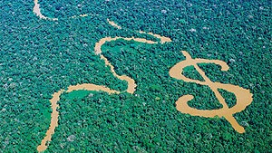
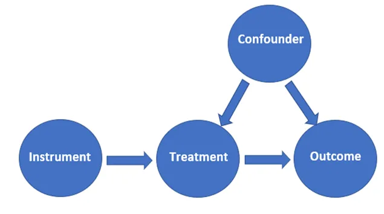
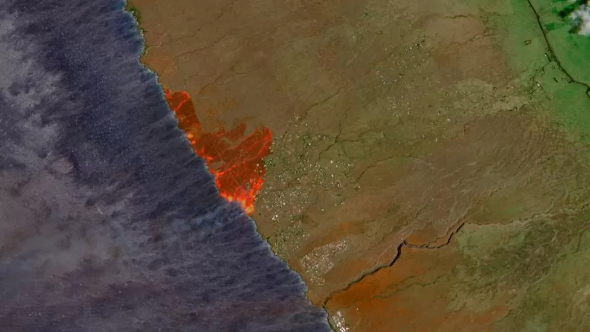

background-image: url(files/wildfire43.png)
background-position: center
background-size: contain

---

layout: true
class: split-three

.column.bg-main1[.content.vmiddle.center[
# environmental 
# economics

.row[.content.nopadding[
.fig90[]
]]

]]

.column.bg-main2[.content.vmiddle.center[
# causal 
# inference

.row[.content.nopadding[
.fig90[]
]]

]]
.column.bg-main3[.content.vmiddle.center[
# innovative 
# data

.row[.content.nopadding[
.fig90[]
]]

]]

---
class: show-1000
---
class: show-1100
count: false
---
class: show-1110
count: false
---
count: false

---
layout: false
class: bg-main1 center middle hide-slide-number

.column.slide-in-left[
.sliderbox.vmiddle.shade_main.center[
.font5[See you in Feb!]]]
.column[
]

